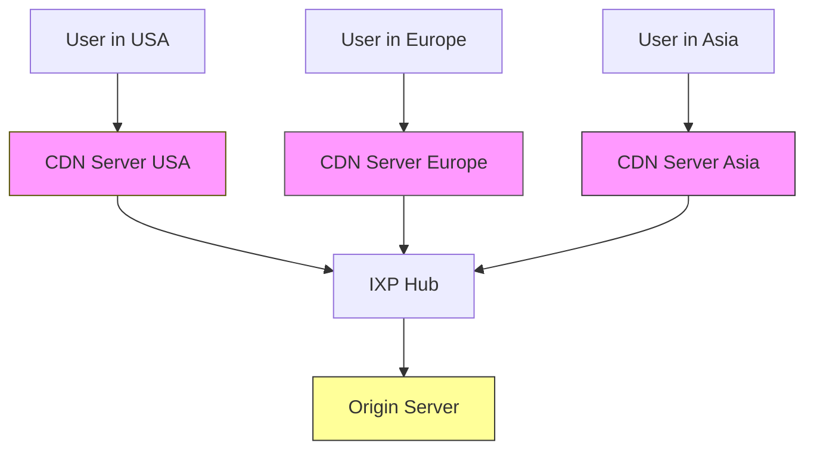
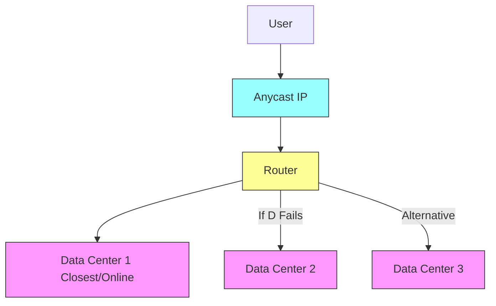
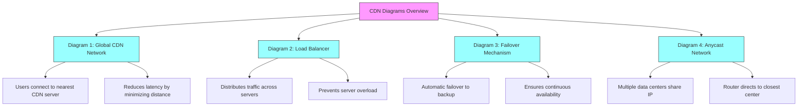
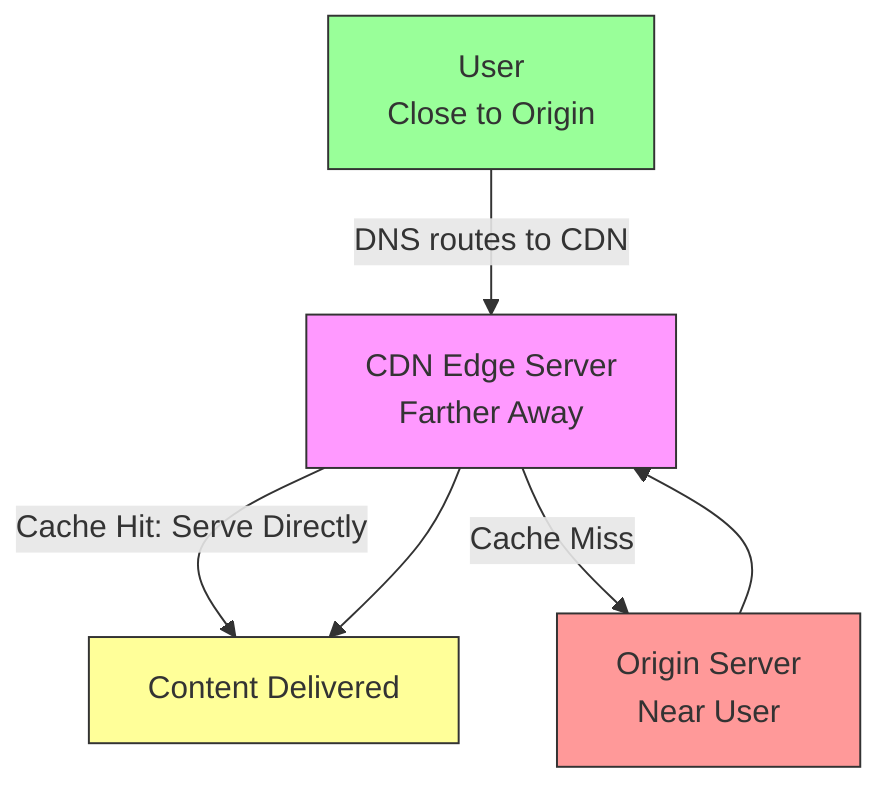
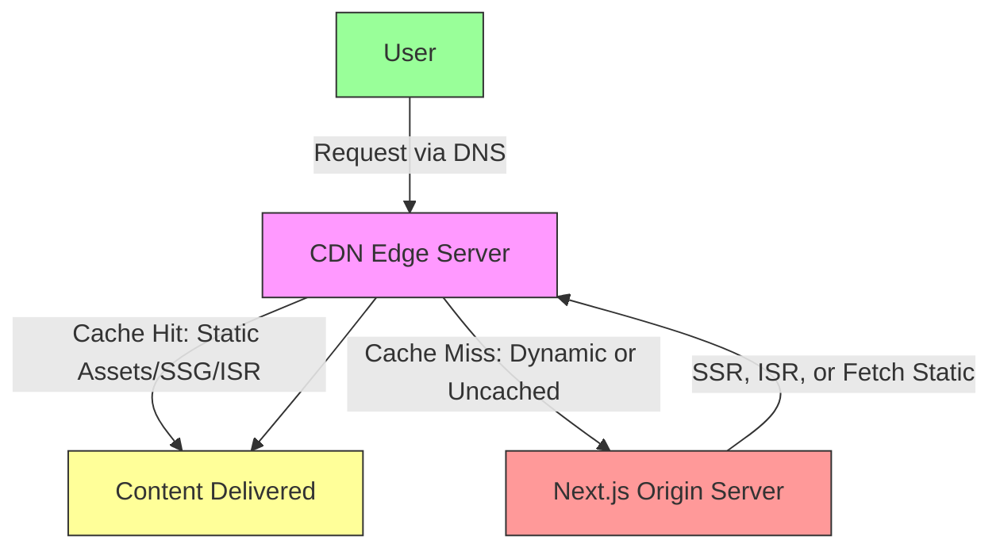

# Introduction to CDNs

A Content Delivery Network (CDN) is a geographically distributed group of servers that caches content close to end users. This allows for quick transfer of assets needed for loading Internet content, such as HTML pages, JavaScript files, stylesheets, images, and videos.

CDNs are increasingly popular, serving the majority of web traffic today, including from major sites like Facebook, Netflix, and Amazon. A properly configured CDN can also protect websites against malicious attacks, such as Distributed Denial of Service (DDoS) attacks.

### Is a CDN the Same as Web Hosting?

No. A CDN does not host content and cannot replace proper web hosting. Instead, it caches content at the network edge to improve performance. Many websites use CDNs because traditional hosting struggles with performance demands. CDNs reduce hosting bandwidth, prevent service interruptions, and enhance security, addressing key pain points of traditional hosting.

## Benefits of Using a CDN

The benefits vary by site size and needs, but they generally fall into four categories:

1. **Improving Website Load Times**  
   By distributing content closer to users via nearby CDN servers, visitors experience faster loading. This reduces bounce rates and increases time spent on the site. Optimizations like efficient load balancing and file compression further help.

2. **Reducing Bandwidth Costs**  
   CDNs cache content, reducing data transferred from the origin server. This lowers hosting costs, as bandwidth consumption is a major expense.

3. **Increasing Content Availability and Redundancy**  
   CDNs handle high traffic and hardware failures better due to their distributed nature. Features like load balancing and intelligent failover minimize downtime.

4. **Improving Website Security**  
   CDNs provide DDoS mitigation, updated TLS/SSL certificates, and other optimizations for authentication, encryption, and integrity.

## How a CDN Works

At its core, a CDN is a network of servers linked to deliver content quickly, cheaply, reliably, and securely. Servers are placed at Internet Exchange Points (IXPs) for high-speed connections.

### Key Mechanisms

- **Server Placement and Optimizations**: CDNs use global data centers, enhance security, and survive failures/congestion.
- **Latency Reduction**: Reduces distance to users, uses hardware/software optimizations (e.g., load balancing, solid-state drives), file compression/minification, and TLS/SSL speedups.
- **Reliability and Redundancy**:
  - **Load Balancing**: Distributes traffic evenly across servers to handle spikes and failures.
  - **Failover**: Automatically reroutes traffic from failed servers to backups.
  - **Anycast Routing**: Multiple servers share an IP; requests go to the closest/available one, aiding DDoS mitigation.
- **Bandwidth Cost Reduction**: Caches content to minimize origin server traffic, like local caching in the pizza delivery analogy.
- **Security**: Fresh TLS/SSL certificates and DDoS protection.

### CDN Request Flow

When a user requests content:

1. DNS resolves to the CDN.
2. Nearest edge server checks cache.
3. Cache hit: Deliver immediately.
4. Cache miss: Fetch from origin, cache, and deliver.

## Diagrams Representing CDN Concepts

Below are Mermaid diagrams from our discussion, each with titles and explanations.

### Diagram 1: Representation of a Globally Distributed CDN Network

This diagram illustrates how a CDN consists of servers spread across the world (e.g., in USA, Europe, Asia). Users connect to the nearest CDN server for fast content delivery, which caches data from the central origin server. It shows the flow: Users → Nearby CDN Server → IXP Hub (if needed) → Origin Server. This reduces latency by minimizing data travel distance.

### Diagram 2: CDN Load Balancer Representation

This diagram depicts how a load balancer distributes incoming traffic spikes evenly across multiple servers (e.g., Server 1, 2, 3). It acts like a traffic director, ensuring no single server is overwhelmed, which is key for handling high traffic or attacks. The flow: Incoming Traffic → Load Balancer → Branched to Servers. It also allows dynamic addition/removal of servers for scalability.

### Diagram 3: CDN Failover Representation

This diagram shows the failover mechanism: When a primary server fails, traffic is automatically rerouted to a backup server. It ensures continuous availability. The flow: User Request → Primary Server (failed) → Failover Activated → Backup Server. This provides redundancy and prevents downtime from hardware issues.

### Diagram 4: Anycast Network Representation

This diagram represents Anycast routing, where multiple data centers share the same IP address. Routers direct requests to the closest or available data center. If one fails, traffic shifts to another. The flow: User → Anycast IP → Router → Closest Data Center (with branches to alternatives). It's useful for reliability during failures or DDoS attacks by distributing load.

### Overview Mindmap of All Diagrams

This mindmap provides a structured overview of the four diagrams.

## Special Scenarios: User Closer to Origin Server Than CDN Server

If a user is geographically closer to the origin server than any CDN server, the request flow typically still involves the CDN due to DNS configuration.

### Flow in This Scenario

1. User sends request.
2. DNS directs to CDN (via CNAME or similar).
3. CDN edge server (even if farther) checks cache:
   - Cache hit: Serve directly (optimized for speed).
   - Cache miss: Fetch from origin (closer to user but via CDN network), cache, and deliver.
4. Benefits like caching, security, and optimizations often make it faster than direct access.

### Bypass Case (Rare)

If configured to bypass CDN (e.g., for dynamic content), flow is: User → DNS → Origin Server → User. This loses CDN advantages.

### Diagram: CDN Request Flow When User Is Closer to Origin Server

This diagram shows a user geographically closer to the origin server but still routed through the CDN. The request goes to the CDN edge server (via DNS), which either serves cached content or fetches from the origin server. The flow: User → CDN Edge Server → (if cache miss) Origin Server → User. It highlights that the CDN handles the request despite the origin’s proximity, leveraging caching and optimizations.

## Relationship Between CDNs and Next.js

Next.js (a React framework for fast web apps) integrates seamlessly with CDNs for enhanced performance.

### Key Aspects of the Relationship

- **Static Asset Delivery**: CDNs cache Next.js static files (e.g., from `/public`) globally.
- **Vercel Integration**: Vercel's hosting (creators of Next.js) includes a built-in CDN for automatic caching of SSG/ISR pages.
- **Image Optimization**: Next.js’s `next/image` with CDN caching for resized/lazy-loaded images.
- **Caching Strategies**: Supports aggressive caching for static content; `stale-while-revalidate` for dynamic.
- **Custom Configurations**: Use `assetPrefix` in `next.config.js` for CDNs like Cloudflare or AWS CloudFront.
- **Examples**:
  - AWS CloudFront: Store assets in S3, reference via env vars.
  - Plugins: Like `next-plugin-cdn` for automated uploads.
- **Challenges**: Weak default caching for `/public`; configure long max-age. Misconfigurations (e.g., Azure CDN) can cause lags—monitor cache hits.

### Diagram: Next.js and CDN Integration

This diagram illustrates the flow of a user request in a Next.js app using a CDN. The user’s request goes to the CDN edge server, which serves cached static assets (e.g., images, CSS, JS) or pre-rendered pages (SSG/ISR). For dynamic content or cache misses, the CDN fetches from the Next.js origin server, which may generate content via SSR or ISR. The CDN caches the response for future requests, reducing latency and origin load.

## Conclusion

CDNs are essential for modern web performance, offering speed, cost savings, reliability, and security. They complement frameworks like Next.js for global scalability. This file synthesizes our entire discussion—feel free to reference or expand on specific sections.
