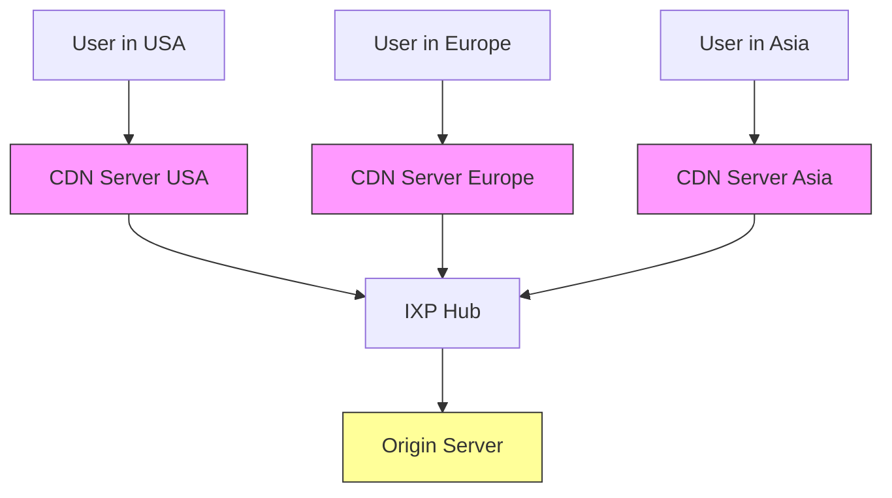
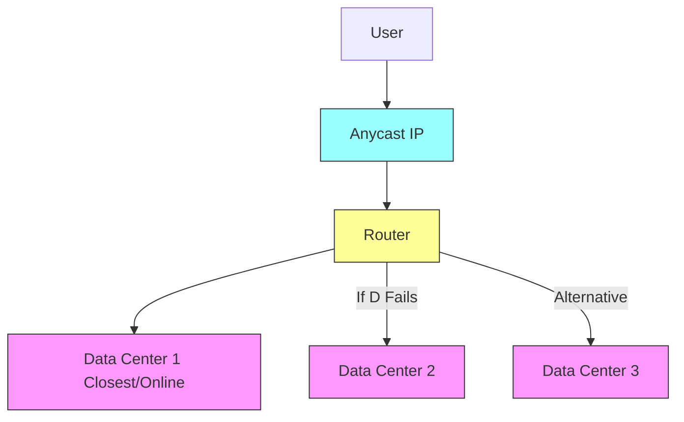
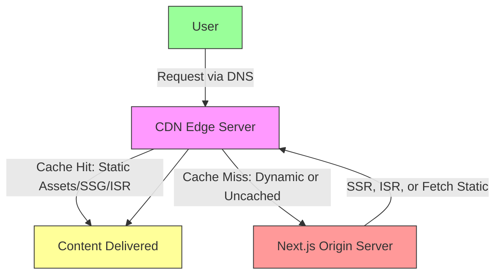

## Introduction to CDNs

---

A Content Delivery Network (CDN) is a geographically distributed group of servers that caches content close to end users. This allows for quick transfer of assets needed for loading Internet content, such as HTML pages, JavaScript files, stylesheets, images, and videos.

---

## Is a CDN the Same as Web Hosting?

No. A CDN does not host content and cannot replace proper web hosting. Instead, it caches content at the network edge to improve performance.

---

## Benefits of Using a CDN

1. **Improving Website Load Times**
2. **Reducing Bandwidth Costs**
3. **Increasing Content Availability and Redundancy**
4. **Improving Website Security**

---

## How a CDN Works

A CDN is a network of servers linked to deliver content quickly, cheaply, reliably, and securely.

### Key Mechanisms

- Server Placement and Optimizations
- Latency Reduction
- Reliability and Redundancy
- Bandwidth Cost Reduction
- Security

---

## CDN Request Flow

1. DNS resolves to the CDN.
2. Nearest edge server checks cache.
3. Cache hit: Deliver immediately.
4. Cache miss: Fetch from origin, cache, and deliver.

---

## Representation of a Globally Distributed CDN Network

---

---

## CDN Load Balancer Representation

---

## CDN Failover Representation

---

## Anycast Network Representation

---

## Special Scenarios: User Closer to Origin Server Than CDN Server

If a user is geographically closer to the origin server than any CDN server, the request flow typically still involves the CDN due to DNS configuration.

---

## Relationship Between CDNs and Next.js

Next.js integrates seamlessly with CDNs for enhanced performance.

### Key Aspects of the Relationship

- Static Asset Delivery
- Vercel Integration
- Image Optimization
- Caching Strategies
- Custom Configurations

---

## Next.js and CDN Integration

---

## Conclusion

CDNs are essential for modern web performance, offering speed, cost savings, reliability, and security.
