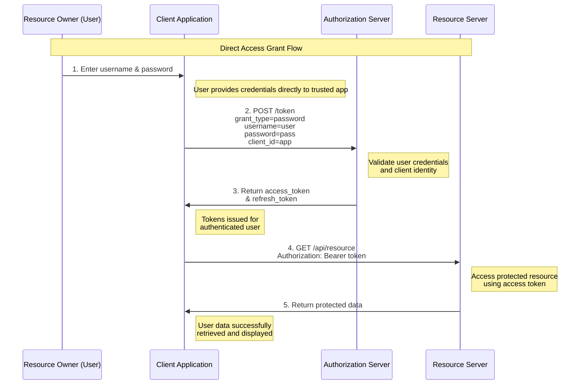

# Direct Access Grant (Resource Owner Password Credentials)

The Direct Access Grant flow, also known as Resource Owner Password Credentials (ROPC), is one of the OAuth 2.0 grant types that enables applications to obtain access tokens by directly using the resource owner's credentials.

## What is Direct Access Grant?

Direct Access Grant is an OAuth 2.0 authentication flow designed for highly trusted applications. Unlike other OAuth flows that redirect users to authorization servers, this flow allows the client application to directly collect and use the user's username and password to obtain access tokens.

## Key Characteristics

- **Direct credential handling**: The client application directly collects user credentials
- **No browser redirects**: Authentication happens without browser-based redirections
- **Trusted relationship required**: Only suitable for applications with high user trust
- **Simplified process**: Fewer steps compared to authorization code flow

## The Authentication Process

The Direct Access Grant flow involves four main participants:

1. **Resource Owner** - The user who owns the protected data
2. **Client** - The trusted application requesting access (mobile app, desktop app)
3. **Authorization Server** - The identity provider that validates credentials (Keycloak)
4. **Resource Server** - The API server hosting protected resources

### Process Flow

1. **Credential Collection**: The resource owner (user) provides their username and password directly to the client application
2. **Authentication Request**: The client sends these credentials along with its own client credentials to the authorization server
3. **Validation**: The authorization server validates both the client identity and user credentials
4. **Token Issuance**: Upon successful validation, the authorization server issues access and refresh tokens
5. **Resource Access**: The client uses the access token to request protected resources from the resource server

## Direct Access Grant Flow Diagram

The following diagram illustrates the complete Direct Access Grant flow:

### Flow Breakdown:

1. **Credential Collection**: User enters username and password directly into the trusted client application
2. **Token Request**: Client sends user credentials along with its own client credentials to the authorization server
3. **Token Response**: Authorization server validates credentials and returns access and refresh tokens
4. **Resource Request**: Client uses the access token to request protected resources from the resource server
5. **Resource Response**: Resource server validates the token and returns the requested data

## When to Use Direct Access Grant

### Appropriate Scenarios:
- **First-party mobile applications** - Your organization's own mobile apps
- **Legacy system migration** - Transitioning from basic authentication to OAuth
- **Command-line tools** - CLI applications where browser flows are impractical
- **Internal enterprise applications** - High-trust internal systems

### Avoid When:
- **Third-party applications** - External developers' applications
- **Web applications** - Browser-based applications should use authorization code flow
- **Public clients** - Applications that cannot securely store client secrets
- **Low-trust environments** - When user trust in the application is limited

## Advantages and Disadvantages

### Advantages:
- **Simplicity** - Straightforward implementation with fewer steps
- **No browser dependency** - Works in environments without web browsers
- **Direct user experience** - Users interact only with the client application
- **Suitable for mobile** - Good fit for native mobile applications

### Disadvantages:
- **Security risks** - Client application handles sensitive user credentials
- **Limited scope** - Only suitable for highly trusted applications
- **No consent screen** - Users cannot review requested permissions
- **Credential exposure** - Passwords are transmitted to the client application

## Security Considerations

### Risks:
- User credentials are exposed to the client application
- Potential for credential theft or misuse
- No granular consent mechanism
- Difficult to audit access patterns

### Best Practices:
- Use only with first-party, highly trusted applications
- Implement secure credential transmission (HTTPS only)
- Use short-lived access tokens
- Implement proper token refresh mechanisms
- Regular security audits and monitoring

## Conclusion

Direct Access Grant provides a simple authentication mechanism for trusted applications but comes with significant security considerations. It should be used carefully and only in scenarios where the high level of trust between the user and application is established and maintained.

---
