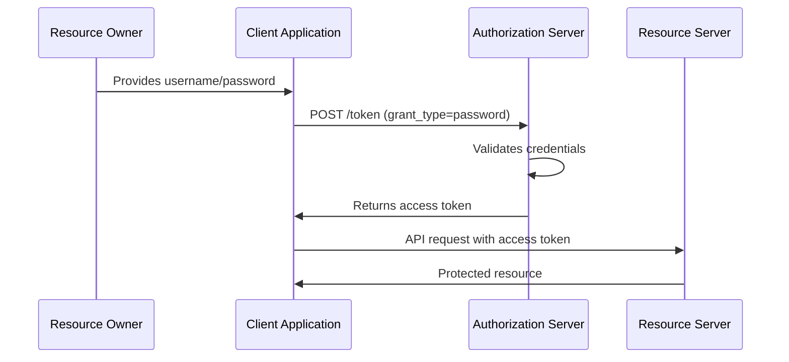

# Direct Access Grant (Resource Owner Password Credentials)


The Direct Access Grant flow, also known as Resource Owner Password Credentials (ROPC), is one of the OAuth 2.0 grant types that allows applications to obtain access tokens by directly using the resource owner's credentials.

## Overview

The Direct Access Grant flow is designed for trusted applications where the client can securely handle user credentials. This flow is typically used in scenarios where:

- The client is a first-party application
- High trust exists between the resource owner and the client
- Other OAuth flows are not feasible

## When to Use Direct Access Grant

### Appropriate Use Cases:
1. **Legacy system migration** - Transitioning from basic auth to OAuth
2. **Mobile applications** - Native mobile apps with secure credential storage
3. **First-party applications** - Applications owned by the same organization as the authorization server
4. **Command-line tools** - CLI applications where browser-based flows are impractical

### Security Considerations:
- Only use with trusted clients
- Credentials are exposed to the client application
- Less secure than authorization code flow
- Should be avoided for third-party applications

## Flow Diagram



## Implementation Steps

### 1. Client Registration
- Register your application with the authorization server
- Obtain client credentials (client_id, client_secret)
- Configure allowed grant types to include "password"

### 2. Token Request
The client makes a POST request to the token endpoint:

```http
POST /auth/realms/{realm}/protocol/openid-connect/token
Content-Type: application/x-www-form-urlencoded

grant_type=password
&client_id={client_id}
&client_secret={client_secret}
&username={username}
&password={password}
&scope={scope}
```

### 3. Token Response
Successful response includes:

```json
{
  "access_token": "eyJhbGciOiJSUzI1NiIs...",
  "token_type": "Bearer",
  "expires_in": 300,
  "refresh_token": "eyJhbGciOiJIUzI1NiIs...",
  "scope": "openid profile email"
}
```

## Keycloak Configuration

### Enable Direct Access Grant
1. Navigate to Keycloak Admin Console
2. Select your realm and client
3. Go to Settings tab
4. Enable "Direct Access Grants Enabled"
5. Configure appropriate scopes and roles

### Client Configuration
```json
{
  "clientId": "my-app",
  "enabled": true,
  "directAccessGrantsEnabled": true,
  "standardFlowEnabled": false,
  "implicitFlowEnabled": false,
  "serviceAccountsEnabled": false
}
```

## Code Examples

### JavaScript/Node.js
```javascript
async function authenticateWithDirectGrant(username, password) {
  const response = await fetch('/auth/realms/myrealm/protocol/openid-connect/token', {
    method: 'POST',
    headers: {
      'Content-Type': 'application/x-www-form-urlencoded',
    },
    body: new URLSearchParams({
      grant_type: 'password',
      client_id: 'my-client',
      client_secret: 'my-secret',
      username: username,
      password: password,
      scope: 'openid profile'
    })
  });
  
  return await response.json();
}
```

### Python
```python
import requests

def get_access_token(username, password):
    url = "http://keycloak:8080/auth/realms/myrealm/protocol/openid-connect/token"
    
    data = {
        'grant_type': 'password',
        'client_id': 'my-client',
        'client_secret': 'my-secret',
        'username': username,
        'password': password,
        'scope': 'openid profile'
    }
    
    response = requests.post(url, data=data)
    return response.json()
```

## Best Practices

1. **Use HTTPS only** - Never transmit credentials over unencrypted connections
2. **Secure credential storage** - Don't store passwords in plain text
3. **Token management** - Implement proper token refresh and expiration handling
4. **Error handling** - Handle authentication failures gracefully
5. **Logging** - Log authentication attempts for security monitoring

## Common Issues and Troubleshooting

### Invalid Grant Error
- Check if Direct Access Grant is enabled for the client
- Verify client credentials are correct
- Ensure user credentials are valid

### Scope Issues
- Verify requested scopes are allowed for the client
- Check user has necessary roles/permissions

### CORS Problems
- Configure proper CORS settings in Keycloak
- Ensure client origins are whitelisted

## Security Implications

### Risks:
- Credentials exposed to client application
- Phishing attacks possible
- No consent screen for user
- Difficult to revoke access granularly

### Mitigations:
- Use only with trusted first-party clients
- Implement strong client authentication
- Regular security audits
- Monitor for suspicious activity

## Conclusion

Direct Access Grant provides a straightforward way to authenticate users in trusted environments, but should be used judiciously due to security implications. Consider authorization code flow with PKCE for better security in most scenarios.

---
