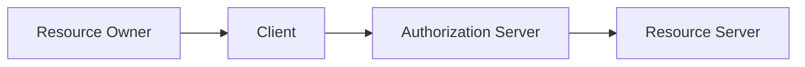
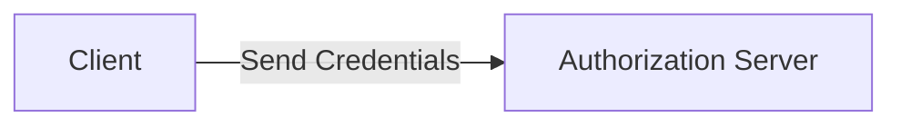
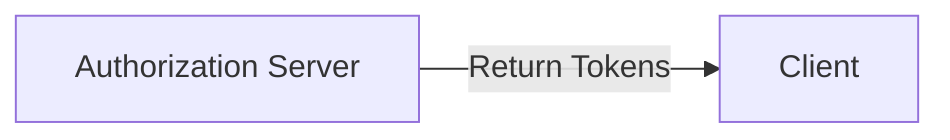
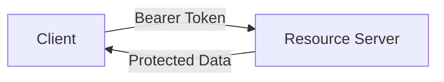
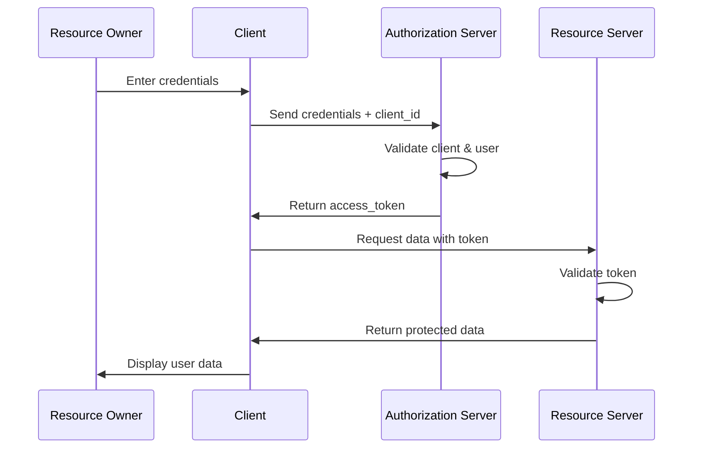

# Direct Access Grant Flow
## Resource Owner Password Credentials

---

## What is Direct Access Grant?

OAuth 2.0 grant type for **highly trusted applications**

- **Resource Owner** (User) provides credentials directly to **Client** (Application)
- No browser redirects or authorization screens
- Simple authentication flow with fewer steps
- Designed for first-party applications only

---

## OAuth 2.0 Components Explained

### The Four Key Players:

- **👤 Resource Owner** = The User (person who owns the data)
- **📱 Client** = The Application (mobile app, desktop app)
- **🏛️ Authorization Server** = Identity Provider (Keycloak, Auth0)
- **🌐 Resource Server** = Backend API (holds protected resources)

*In our context: User logs into a mobile app to access their profile data from a backend service*

---

## Advantages & Disadvantages

### ✅ **Advantages:**
- **Simple Implementation** - Fewer steps than other OAuth flows
- **No Browser Required** - Perfect for mobile and CLI applications
- **Direct User Experience** - Users stay within the application
- **Legacy System Friendly** - Easy migration from basic auth

### ❌ **Disadvantages:**
- **Security Risk** - Client handles user passwords
- **Limited Trust Model** - Only for highly trusted applications
- **No Consent Screen** - Users can't review permissions
- **Credential Exposure** - Passwords transmitted to client

---

## Step 1: Credential Collection

**Resource Owner** (User) enters credentials into **Client** (Application)

**What happens:** 
- User opens the trusted application
- Application presents a login interface
- User enters their username and password directly
- User trusts the application with their credentials

**Key Point:** This requires complete trust between user and application

---

## Step 2: Authentication Request

**Client** (Application) sends credentials to **Authorization Server** (Keycloak)

The client application collects:
- User's username and password
- Client's own identification credentials
- Requested access scopes

**Key Point:** Both user credentials and client credentials are validated

---

## Step 3: Validation & Token Issuance

**Authorization Server** validates and issues tokens

**Validation Process:**
- Verify client identity and permissions
- Authenticate user credentials
- Check if client is allowed to use Direct Access Grant
- Generate access and refresh tokens

**Result:** Client receives tokens to access protected resources

---

## Step 4: Resource Access

**Client** uses token to access **Resource Server**

- Includes access token in request headers
- Requests protected user data
- Receives authorized information

**Final Step:** User sees their data displayed in the application

---

---

## Security Best Practices

### **Key Risks:**
- User credentials exposed to client application
- No granular permission consent
- Potential for credential theft or misuse

### **Essential Mitigations:**
- Use only with highly trusted first-party clients
- Implement HTTPS everywhere
- Configure short token lifetimes
- Enable strong client authentication
- Conduct regular security audits

---
