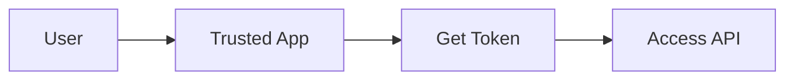
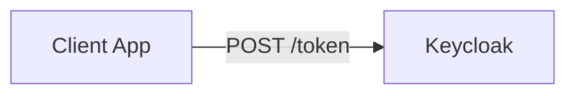
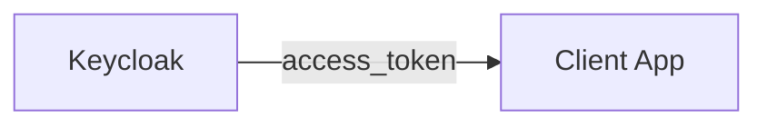
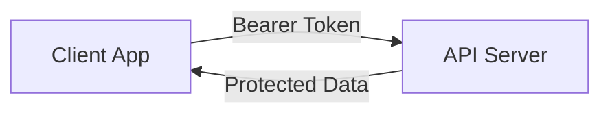
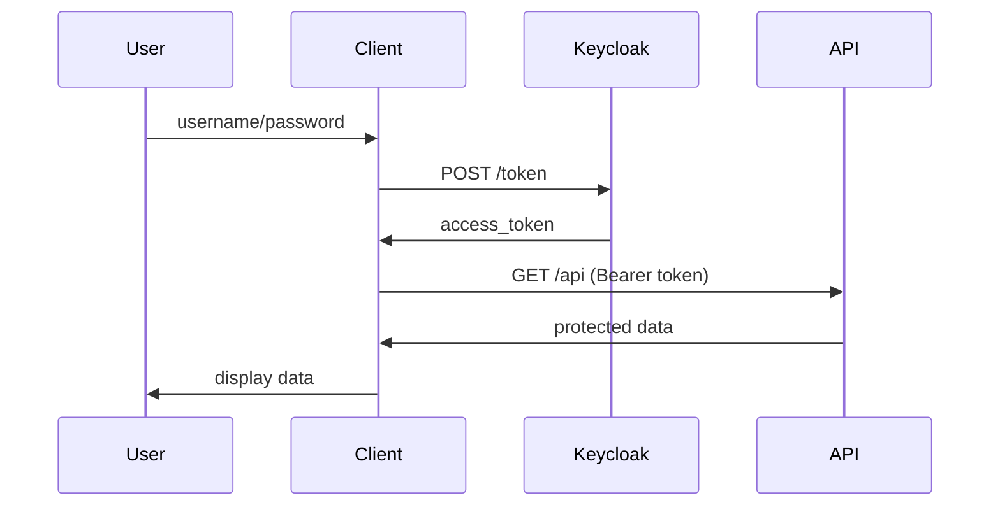

# Direct Access Grant Flow
## Resource Owner Password Credentials

---

## What is Direct Access Grant?

OAuth 2.0 grant type for **trusted applications**

- Client uses user's username/password directly
- No browser redirects needed
- Simple but requires high trust



---

## Step 1: User Login

User enters credentials in the trusted application

```
┌─────────────────┐
│   Login Form    │
│                 │
│ Username: [___] │
│ Password: [___] │
│                 │
│    [Login]      │
└─────────────────┘
```

---

## Step 2: Token Request

Client sends credentials to authorization server

```http
POST /auth/realms/demo/protocol/openid-connect/token

grant_type=password
username=john@example.com
password=secret123
client_id=my-app
client_secret=app-secret
```



---

## Step 3: Token Response

Keycloak validates and returns tokens

```json
{
  "access_token": "eyJhbGc...",
  "token_type": "Bearer",
  "expires_in": 300,
  "refresh_token": "eyJhbGc..."
}
```



---

## Step 4: API Access

Client uses token to access protected resources

```http
GET /api/user-data
Authorization: Bearer eyJhbGc...
```



---

## Complete Flow



---

## When to Use

✅ **Good for:**
- First-party mobile apps
- Command-line tools
- Legacy system migration

❌ **Avoid for:**
- Third-party applications
- Web applications
- Untrusted clients

---
