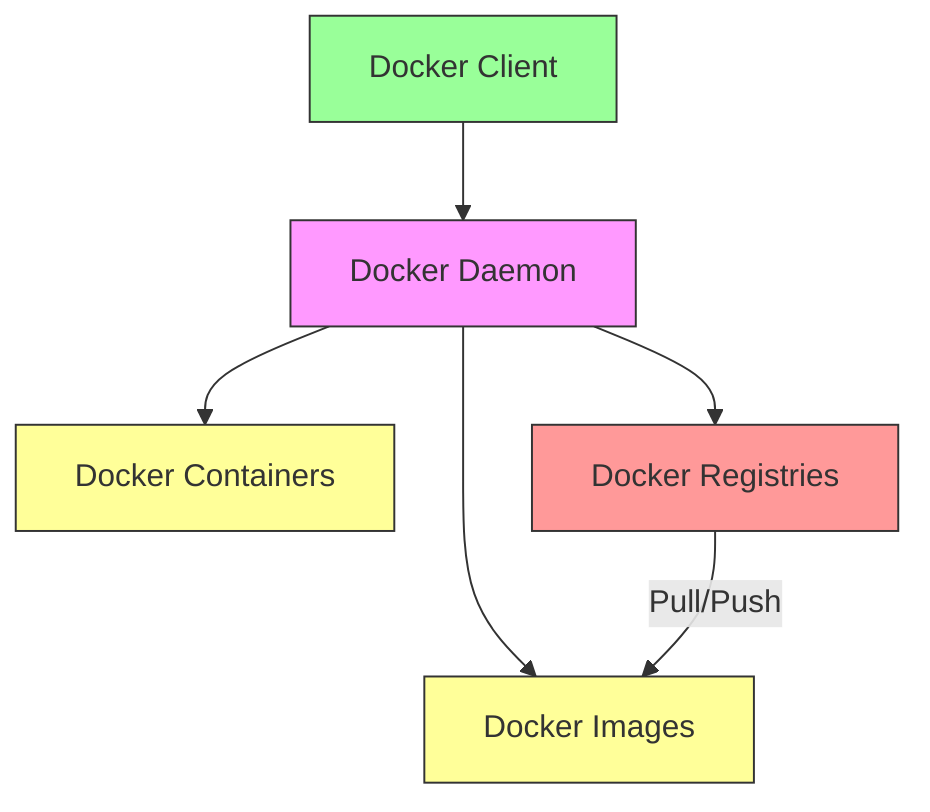
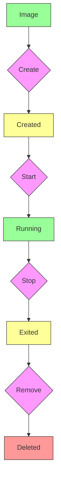

# Introduction to Docker

Docker is an open-source platform that automates the deployment, scaling, and management of applications using containerization. Containers are lightweight, portable, and self-sufficient units that package an application and all its dependencies, ensuring it runs consistently across different environments.

## Why Use Docker?

1. **Portability**: Containers encapsulate everything an application needs, making it easy to move between development, testing, and production environments without compatibility issues.
2. **Consistency**: Ensures that your application runs the same way regardless of where it's deployed, eliminating "it works on my machine" problems.
3. **Isolation**: Containers isolate applications from each other and from the underlying host system, improving security and preventing conflicts.
4. **Efficiency**: Containers are much lighter than virtual machines, allowing for higher density on a single host and faster startup times.
5. **Scalability**: Easily scale applications by spinning up new containers as needed, often integrated with orchestration tools like Kubernetes.
6. **Faster Development Cycles**: Developers can quickly build, test, and deploy applications, accelerating the software delivery process.

## How Docker Works

Docker uses a client-server architecture. The Docker client talks to the Docker daemon, which does the heavy lifting of building, running, and distributing Docker containers.

### Key Components

* **Docker Engine**: The core component that runs and manages containers. It includes:
  * **Docker Daemon (dockerd)**: The background service that manages Docker objects (images, containers, networks, volumes).
  * **Docker CLI**: The command-line interface for interacting with the daemon.
  * **REST API**: An API for programs to interact with the daemon.
* **Docker Images**: Read-only templates with instructions for creating a Docker container. They are built from a `Dockerfile`.
* **Docker Containers**: Runnable instances of a Docker image.
* **Docker Hub/Registries**: Repositories for storing and sharing Docker images.

### Diagram: Docker Architecture

This diagram illustrates the main components of the Docker architecture and how they interact.

## Docker Commands (Basic)

* `docker build -t myimage .`: Builds an image from a `Dockerfile`.
* `docker run -p 80:80 myimage`: Runs a container from an image, mapping port 80.
* `docker ps`: Lists running containers.
* `docker images`: Lists local images.
* `docker stop [container_id]`: Stops a running container.
* `docker rm [container_id]`: Removes a container.
* `docker rmi [image_id]`: Removes an image.

### Diagram: Container Lifecycle

This diagram shows the typical lifecycle of a Docker container.

## Docker Compose

Docker Compose is a tool for defining and running multi-container Docker applications. You use a YAML file to configure your application's services, networks, and volumes, and then a single command (`docker-compose up`) to start everything.

## Conclusion

Docker has revolutionized software development and deployment by providing a standardized way to package and run applications. Its benefits in portability, consistency, and efficiency make it an indispensable tool for modern DevOps and cloud-native development.