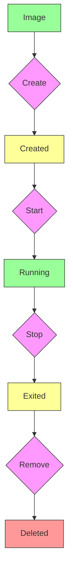

## Introduction to Docker

Docker is a platform for developing, shipping, and running applications in containers.

---


---

## Why Use Docker?

1.  **Portability**
2.  **Consistency**
3.  **Isolation**
4.  **Efficiency**
5.  **Scalability**
6.  **Faster Development Cycles**

---

## How Docker Works

Docker uses a client-server architecture. The Docker client talks to the Docker daemon.

### Key Components:

*   **Docker Engine**
*   **Docker Images**
*   **Docker Containers**
*   **Docker Hub/Registries**

---

## Docker Architecture

### Diagram: Docker Architecture

```mermaid
graph TD
    A[Docker Client (CLI)] --> B[Docker Daemon]
    B --> C[Docker Images]
    B --> D[Docker Containers]
    B --> E[Docker Registries (e.g., Docker Hub)]
    E -- Pull/Push --> C
    style A fill:#9f9,stroke:#333
    style B fill:#f9f,stroke:#333
    style C fill:#ff9,stroke:#333
    style D fill:#ff9,stroke:#333
    style E fill:#f99,stroke:#333
```

---

## Docker Commands (Basic)

*   `docker build -t myimage .`
*   `docker run -p 80:80 myimage`
*   `docker ps`
*   `docker images`
*   `docker stop [container_id]`
*   `docker rm [container_id]`
*   `docker rmi [image_id]`

---

## Container Lifecycle

### Diagram: Container Lifecycle



---

## Docker Compose

Docker Compose is a tool for defining and running multi-container Docker applications.

---

## Conclusion

Docker has revolutionized software development and deployment by providing a standardized way to package and run applications.
