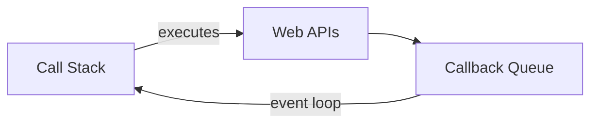

# Introduction to JavaScript

JavaScript is the language of the web. It powers dynamic behavior in browsers and, with Node.js, on servers.

## Why Use JavaScript?

1. **Ubiquity**: Runs everywhere the web runs
2. **Ecosystem**: Massive package ecosystem (npm)
3. **Interactivity**: Enables rich, reactive UIs
4. **Full‑stack**: Same language on client and server

## Core Concepts

- Types and values (primitives vs objects)
- Functions and closures
- Prototypes and classes
- Modules (ESM)
- Asynchronous programming: Promises and async/await

### Diagram: Event Loop (Simplified)

## Tooling

- Package managers: npm, pnpm, yarn
- Transpilers/bundlers: TypeScript, Vite, Webpack

## Conclusion

JavaScript’s versatility and reach make it a foundational skill for modern development. 

---