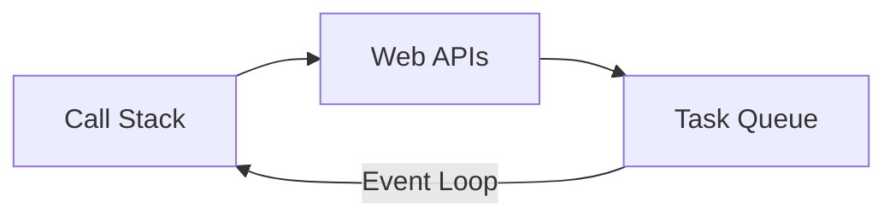

## Introduction to JavaScript

JavaScript powers interactivity on the web and beyond.

---

## Why Use JavaScript?

1. **Ubiquity**
2. **Ecosystem**
3. **Interactivity**
4. **Full‑stack**

---

## Core Concepts

- Types, functions, closures
- Promises and async/await
- Modules (ESM)

---

## Event Loop

---

## Tooling

Vite, TypeScript, pnpm, Node.js 