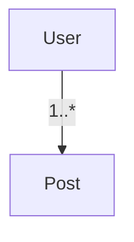

# Introduction to Prisma

Prisma is a next‑generation ORM that provides end‑to‑end type safety and a great developer experience for working with databases.

## Why Use Prisma?

1. **Type‑safe queries**
2. **Auto‑generated client**
3. **Schema‑first modeling**
4. **Migrations**

## Key Concepts

- Prisma Schema (`schema.prisma`)
- Migrate (history of schema changes)
- Prisma Client (typed queries)

### Diagram: Simple Data Model

## Conclusion

Prisma streamlines database access with modern tooling and great DX. 