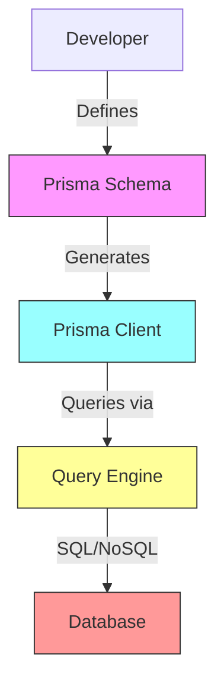
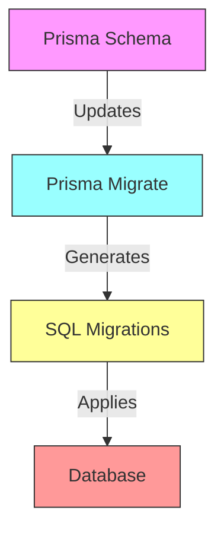
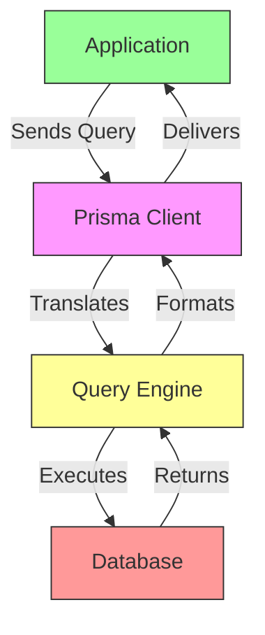
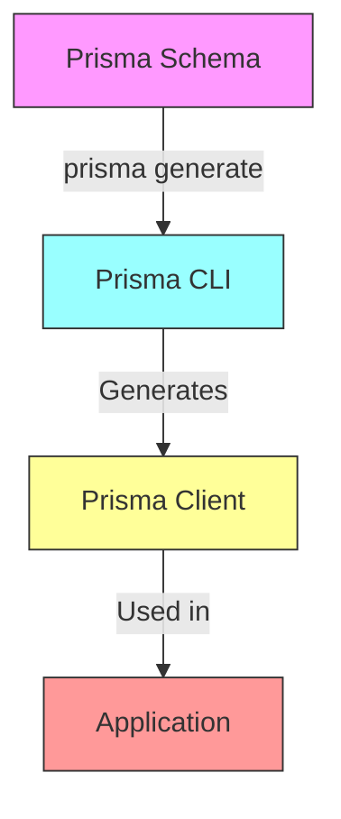
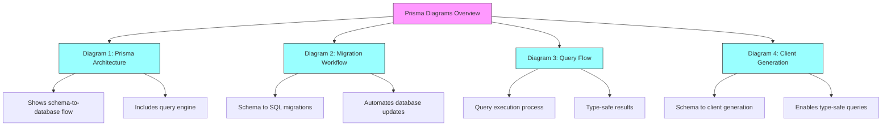

---

Prisma is an open-source ORM (Object-Relational Mapping) tool designed to streamline database interactions in modern applications. It provides a type-safe, intuitive API for working with databases like PostgreSQL, MySQL, SQLite, MongoDB, and SQL Server. Prisma simplifies tasks like querying, migrations, and data modeling, making it a popular choice for developers building applications with Node.js and TypeScript.

Unlike traditional ORMs, Prisma uses a schema-first approach, where developers define their database schema in a Prisma schema file, and Prisma generates type-safe client code. This reduces errors and improves developer productivity. Prisma is widely used in full-stack applications, including those built with frameworks like Next.js, Express, or NestJS.

---

### Is Prisma the Same as a Database?

No. Prisma is not a database but an ORM layer that sits between your application and the database. It does not store data itself but provides tools to interact with databases efficiently. Prisma handles query generation, schema migrations, and data validation, complementing the database rather than replacing it.

---

## Benefits of Using Prisma ORM

Prisma offers several advantages, particularly for developers building modern, scalable applications. The benefits can be grouped into four key categories:

1. **Type-Safe Database Queries**  
   Prisma generates a type-safe client based on your schema, ensuring that queries are validated at compile-time. This reduces runtime errors and improves code reliability, especially in TypeScript projects.

2. **Simplified Database Management**  
   Prisma’s schema file centralizes database structure definitions, making it easier to manage models, relations, and migrations. The Prisma CLI automates migration tasks, reducing manual database administration.

3. **Improved Developer Productivity**  
   With its intuitive query API, Prisma allows developers to write readable and concise database queries. Features like auto-completion and real-time query validation streamline development workflows.

4. **Cross-Database Compatibility**  
   Prisma supports multiple databases (e.g., PostgreSQL, MySQL, MongoDB), allowing developers to switch databases with minimal code changes. This flexibility is ideal for projects with evolving requirements.

---

## How Prisma Works

At its core, Prisma is a toolkit that bridges your application and database through a generated client. It consists of three main components: the **Prisma Schema**, the **Prisma Client**, and the **Prisma Migrate** tool.

---

### Key Mechanisms

- **Prisma Schema**: A declarative file (`schema.prisma`) where you define your data models, relationships, and database connection. This serves as the single source of truth for your database structure.
- **Prisma Client**: A type-safe, auto-generated JavaScript/TypeScript client based on the schema. It provides methods for querying, creating, updating, and deleting data.
- **Prisma Migrate**: A migration tool that generates SQL migrations from changes in the Prisma schema and applies them to the database.
- **Query Engine**: A Rust-based engine that translates Prisma Client queries into database-specific SQL or NoSQL queries, optimizing performance.
- **Data Validation and Security**: Prisma validates input data against the schema, reducing risks like SQL injection.

---

### Prisma Request Flow

When a developer uses Prisma to interact with a database:

1. Define models and relationships in the `schema.prisma` file.
2. Run `prisma generate` to create the Prisma Client.
3. Use the Prisma Client in application code to query the database.
4. The query engine translates client calls into optimized database queries.
5. Results are returned in a type-safe, structured format.

---

## Diagrams Representing Prisma Concepts

Below are Mermaid diagrams illustrating key Prisma concepts, each with explanations.

### Diagram 1: Prisma Architecture Overview

This diagram shows the high-level architecture of Prisma. The developer defines the Prisma Schema, which is used to generate the Prisma Client. The client interacts with the database via the query engine, which handles SQL/NoSQL translation. The flow: Developer → Prisma Schema → Prisma Client → Query Engine → Database.

---

### Diagram 2: Prisma Migration Workflow

This diagram illustrates the migration process. The developer updates the Prisma Schema, and Prisma Migrate generates SQL migrations, which are applied to the database. The flow: Prisma Schema → Prisma Migrate → SQL Migrations → Database.

---

### Diagram 3: Prisma Query Flow

This diagram depicts how a query is executed. The application uses the Prisma Client to send a query, which the query engine translates into a database query. The database returns the result, which is formatted and sent back to the application. The flow: Application → Prisma Client → Query Engine → Database → Result.

---

### Diagram 4: Prisma Schema to Client Generation

This diagram shows the process of generating the Prisma Client from the schema. The developer runs `prisma generate`, which processes the schema and outputs a type-safe client for use in the application. The flow: Prisma Schema → Prisma CLI → Prisma Client.

---

### Overview Mindmap of All Diagrams

This mindmap provides a structured overview of the four diagrams.

---

## Special Scenarios: Handling Complex Relationships in Prisma

In cases where your application involves complex database relationships (e.g., many-to-many or nested relations), Prisma’s schema and query capabilities shine.

---

### Flow for Complex Relationships

1. Define relationships in `schema.prisma` (e.g., `@relation` for many-to-many).
2. Run `prisma generate` to update the Prisma Client with relation-aware methods.
3. Use Prisma Client’s `include` or `select` to fetch related data in a single query.
4. The query engine optimizes the SQL to handle joins or NoSQL traversals efficiently.
